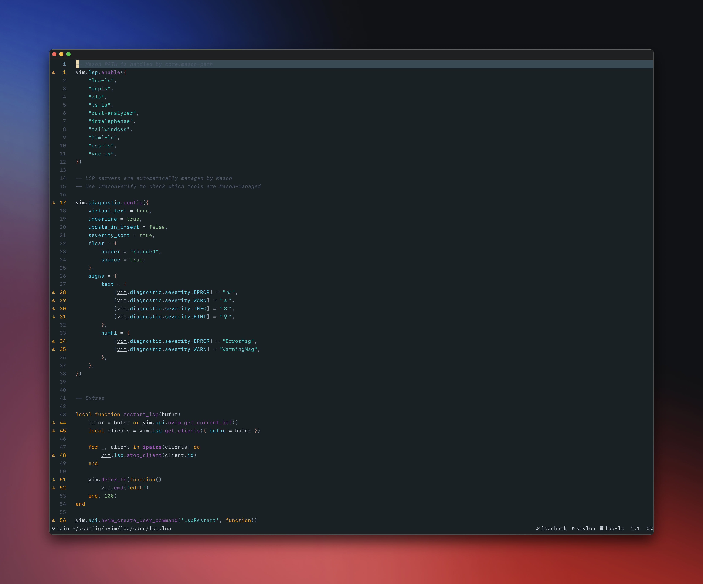

# Forest Night - Ethereal Magic

A beautiful dark theme for Neovim, converted from the original [VS Code Forest Night theme](https://github.com/ForrestKnight/forest-night-theme/).

## Features

- 🌙 Dark theme with a mystical forest aesthetic
- 🎨 Carefully crafted color palette for optimal readability
- 🔥 Full Treesitter support with modern syntax highlighting
- 🚀 LSP semantic token support
- 🔍 Popular plugin support (Telescope, NvimTree, WhichKey, etc.)
- 🎯 Consistent highlighting across different filetypes
- 💻 Terminal color support

## Color Palette

The theme uses a carefully selected color palette inspired by a mystical forest night:

- **Background**: `#1a2125` - Deep forest night
- **Foreground**: `#c9d1d9` - Moonlit text
- **Comments**: `#4a5568` - Subtle forest shadows
- **Functions**: `#9B59B6` - Mystical purple
- **Strings**: `#4ECDC4` - Ethereal cyan
- **Keywords**: `#F39C12` - Warm amber
- **Types**: `#c78a7a` - Earthy coral
- **Constants**: `#8FBC8F` - Forest green

## Installation

### Using [lazy.nvim](https://github.com/folke/lazy.nvim)

```lua
{
  'adibhanna/forest-night.nvim',
  priority = 1000,
  config = function()
    vim.cmd('colorscheme forest-night')
  end,
}
```

### Using [packer.nvim](https://github.com/wbthomason/packer.nvim)

```lua
use {
  'adibhanna/forest-night.nvim',
  config = function()
    vim.cmd('colorscheme forest-night')
  end
}
```

### Using [vim-plug](https://github.com/junegunn/vim-plug)

```vim
Plug 'adibhanna/forest-night.nvim'
```

Then add to your `init.vim` or `init.lua`:

```lua
vim.cmd('colorscheme forest-night')
```

## Usage

### Basic Usage

```lua
-- Set the colorscheme
vim.cmd('colorscheme forest-night')

-- Or using the vim.opt API
vim.opt.background = 'dark'
vim.cmd('colorscheme forest-night')
```

### Configuration

The theme works out of the box, but you can customize it by modifying the colorscheme file or creating your own highlights:

```lua
-- Example: Customize specific highlights after setting the colorscheme
vim.cmd('colorscheme forest-night')

-- Override specific highlights
vim.api.nvim_set_hl(0, 'Comment', { fg = '#6b7280', italic = true })
vim.api.nvim_set_hl(0, 'Function', { fg = '#9B59B6', bold = true })
```

## Plugin Support

This theme includes support for popular Neovim plugins:

- **Treesitter**: Modern syntax highlighting
- **LSP**: Semantic token support and diagnostics
- **Telescope**: Beautiful fuzzy finder styling
- **NvimTree**: File explorer integration
- **WhichKey**: Key binding helper
- **GitSigns**: Git integration
- **Indent Blankline**: Indentation guides
- **Markdown**: Enhanced markdown support
- **Mini.nvim**: Comprehensive support for all mini.nvim modules
- **Trouble**: Diagnostics and quickfix list
- **Noice**: Enhanced UI notifications
- **Mason**: Package manager integration
- **Blink**: Completion engine support
- **Flash**: Jump navigation
- **Snacks**: Various UI enhancements
- **Nvim-DAP**: Debug adapter protocol
- **Conform**: Code formatting
- **Lint**: Linting integration
- **Fidget**: LSP progress notifications
- **Diffview**: Git diff viewer
- **Comment**: Code commenting utilities

## Screenshots



*Forest Night theme showcasing beautiful syntax highlighting with LSP diagnostics and a mystical forest aesthetic*

## Contributing

Contributions are welcome! Feel free to:

1. Report bugs or issues
2. Suggest improvements
3. Submit pull requests
4. Add support for more plugins

## Credits

- Original VS Code theme: [Forest Night Theme](https://github.com/ForrestKnight/forest-night-theme/) by Forrest Knight
- Converted to Neovim by: [adibhanna](https://github.com/adibhanna)

## License

This theme is released under the MIT License. See the original VS Code theme repository for more details.

## Related

- [Original VS Code Forest Night Theme](https://github.com/ForrestKnight/forest-night-theme/)
- [Forrest Knight's YouTube Channel](https://www.youtube.com/channel/UCNBGWGBpJ4-6q-7l6_IVqhg)

---

*"In the depths of the forest night, code comes alive with ethereal magic"* ✨ 